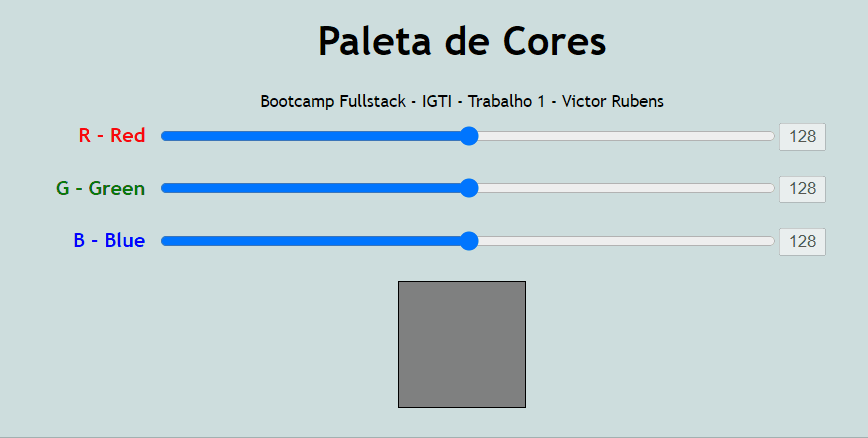

# Trabalho Prático  - Bootcamp: Desenvolvimento Full Stack 
Módulo 1  - Fundamentos do Bootcamp
Professor: Raphael Gomide (@rrgomide)

## Objetivos 
Exercitar os seguintes conceitos trabalhados no Módulo:
 - Utilização de elementos HTML.
 - Utilização de CSS. 
 - Utilização de identificadores em elementos HTML.
 - Captura de referência de elementos com JavaScript.
 - Manipulação de eventos com JavaScript.
 - Utilização de funções com JavaScript e CSS.
 - Manipulação direta de CSS com JavaScript

## Enunciado
Construa, utilizando HTML, CSS e JavaScript puro, uma aplicação para a visualização de cores a partir da escala RGB.

## Atividades
Os alunos deverão desempenhar as seguintes atividades: 
1. **Implementar**, através de **HTML, CSS e JavaScript puro**, uma aplicação que contenha três inputs do tipo **"range"**, cujos valores **vão de 0 a 255** e representem, respectivamente, R (Red – Vermelho), G (Green – Verde) e B (Blue – Azul). 
2. Essa combinação de valores deve ser utilizada para preencher a **cor de fundo** de uma **`
`** quadrada.
3. Além disso, **inclua três inputs de texto somente-leitura (desabilitados)** para a visualização do **valor atual de cada input do tipo range.** 
4. À medida em que o usuário modifica o valor dos ranges com as teclas ← e → do teclado, a  **`
`** deve refletir a cor correspondente. 
5. A imagem abaixo ilustra uma possível interface para a aplicação.

## Dicas
 - Utilize o método **load** de **window.addEventListener** para garantir que o DOM esteja totalmente carregado antes de qualquer instrução JavaScript.
 - Utilize **id's** nos **inputs** e na **div** para mapeá-los no script com **document.querySelector**. Para isso, utilize o evento “input” para mapear a mudança de valores no **input** do tipo **range**. Os **inputs** do tipo **text** devem ser **somente-leitura**.
 - Não se preocupe tanto com a interface gráfica. O mais importante é o código estar funcionando.
 - Para definir a cor da **div**, utilize **style.backgroundColor**. O valor deve ser uma string que, por sua vez, interpola a função rgb() do CSS.

## Trabalho Feito
