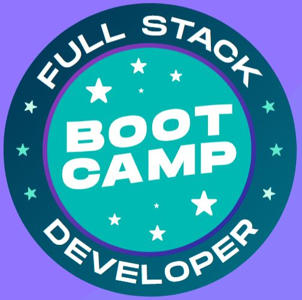

# Bootcamp IGTI - Desenvolvedor Fullstack
{:height="252px" width="250px"}

> O Bootcamp tem como objetivo oferecer uma formação prática e intensiva
> que habilite o profissional para atuar como desenvolvedor Full Stack.

## Sobre o IGTI

> O Instituto de Gestão e Tecnologia da Informação, fundado em 2006, é
> uma instituição de ensino superior credenciada pelo MEC. É referência
> nacional na formação profissional em TI e Tecnologias Emergentes, e
> possui um modelo educacional a distância que prioriza a excelência
> acadêmica dos seus alunos.

## O Curso
**Data de início:** 02/07/20
**Carga horária:** 148h
**Duração:** 2 meses

**Pré-requisitos**
Conhecer lógica de programação, conhecer pelo menos uma linguagem de programação; saber utilizar variáveis, estruturas de decisão, estruturas de repetição e funções; ter noções de HTML e CSS.

**Objetivo principal**
Oferecer uma formação prática e intensiva que habilite o profissional para atuar como desenvolvedor Full Stack.

**Objetivos específicos**
Conheça técnicas de construção de uma aplicação passando por todas as suas camadas lógicas - backend, frontend, persistência de dados NoSQL, controle de versionamento de código com Git e implantação em nuvem - habilitando-se para atuar profissionalmente na área.

## Módulos
**1 - Aquecimento e Regras do Jogo**
Visão geral da dinâmica do curso, conteúdos e ferramentas utilizadas.
**Duração: 4 horas**

**2 - Fundamentos**
Introdução, instalação e configuração do Visual Studio Code (VSCode). Instalação do Node.js. Instalação da biblioteca live-server. Noções de HTML e CSS. Introdução ao JavaScript. Integração do JavaScript com o HTML e CSS. JavaScript básico – console, comentários, tipos primitivos, variáveis, API’s nativas de servidor e web, funções, estruturas de decisão, estruturas de repetição, manipulação de eventos.
**Duração: 32 horas**

**3 - Desenvolvimento de API’s**
Introdução ao desenvolvimento backend. Backend x frontend. Introdução ao desenvolvimento de APIs. Introdução ao desenvolvimento com Node.js. Introdução ao Express. Criação de requisições HTTP, rotas e middlewares com Express. Introdução à ferramenta Insomnia. Construção de APIs HTTP, utilizando as principais operações: GET, POST, PUT, e DELETE. Desenvolvimento das operações CRUD. Persistência de Dados em Arquivos.
**Duração: 32 horas**

**4- FrontEnd com React**
Instalação e configuração do React. Criação de projetos com o create-react-app. Introdução ao React – JSX,Componentes de Funções, Componentes de Classe, State, Props, Binding, Interpolação. Comunicação entre componentes. Ciclo de vida de componentes de classe. Introdução às requisições HTTP com React. Roteamento com react-router. Introdução ao Ionic React. Criação de um pequeno projeto passo-a-passo com React.
**Duração: 32 horas**

**5 - Persistência de dados, versionamento de código e implantação**
Introdução ao MongoDB. Utilização do serviço mLab. Integrando a API ao MongoDB no mLab. Introdução ao Git. Instalação do git. Principais comandos do Git. Como publicar aplicações no Github. Introdução ao Heroku. Instalação do Heroku CLI. Como implantar aplicações no Heroku.
**Duração: 32 horas**

**6 - Desafio Final**
Entrega da aplicação final.
**Duração: 16 horas**